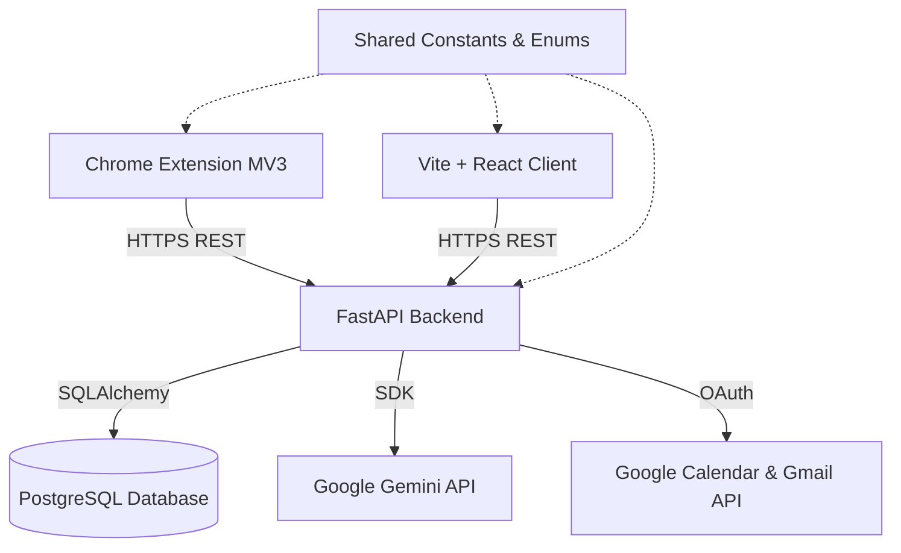

# JobOrbit System Architecture Documentation

This document explains the high-level architecture of JobOrbit, describing the modules, directories, and data interaction flows.

## 1. System Topology Overview
JobOrbit is built as a multi-client, multi-tier software architecture comprising:
1.  **Frontend Client (`joborbit-web`)**: Single Page Application built on React, Vite, and TypeScript.
2.  **Browser Extension (`joborbit-extension`)**: Chrome Manifest V3 extension, providing context scraping.
3.  **Backend REST API (`joborbit-api`)**: Python/FastAPI backend driving core tracking and scheduler modules.
4.  **Shared Declarations (`joborbit-shared`)**: Platform schemas, constants, and enums.

---

## 2. Directory Structure Deep-Dive

### Root Packages
*   **`joborbit-web/`**: Main user portal. Integrates Tailwind CSS v4, React Router, and Zustand.
*   **`joborbit-api/`**: Main logic controller.
*   **`joborbit-extension/`**: Captures job details from Indeed and LinkedIn, communicating with the backend.
*   **`joborbit-shared/`**: Single source of truth containing JSON schemas, lifecycles, and configuration variables.
*   **`docs/`**: Technical specs, databases, APIs, and AI integrations references.

---

## 3. Module Responsibilities

### Frontend (`joborbit-web`)
*   `src/components/common/`: Shared UI (inputs, buttons, overlays).
*   `src/components/layout/`: Screen layout templates (navigation controls, grid bars).
*   `src/config/`: SDK declarations (Firebase config initialization).
*   `src/services/`: Direct API fetch interactions.
*   `src/store/`: State management (auth sessions, settings).

### Backend (`joborbit-api`)
*   `src/app/ai/`: Isolated, first-class artificial intelligence module:
    *   `agents/`: Task-specific helpers (Resume Analyzer, Cover Letter Generator).
    *   `prompts/`: Template strings for prompting LLMs.
    *   `parsers/`: Parsing formats converting text blocks to structured JSON schemas.
    *   `responses/`: Pydantic output layouts.
    *   `integrations/`: Gemini SDK connection wrappers.
    *   `workflows/`: Multi-step prompt execution orchestrators.
*   `src/app/workers/`: Queue-based task consumers handling long-running background tasks (e.g. Gmail syncing, email scanning).
*   `src/app/events/`: Publishers and handlers coordinate action triggers.
*   `tests/`: Unit and integration testing suites.
