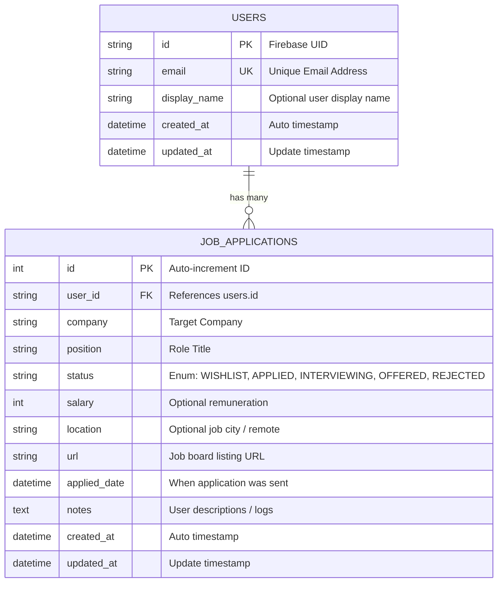

# JobOrbit Database Schema Documentation

This document describes the database design, tables structure, indices, relations, and migrations configuration for JobOrbit.

## 1. Relational Entity Relationship Diagram (ERD)

---

## 2. Table Schemas Detail

### `users` Table
Stores user account profiles synced from Firebase Auth.
*   **`id`** (`String`, PK): Matches the Firebase authentication UID.
*   **`email`** (`String`, Unique): Syncs the user's primary email.
*   **`display_name`** (`String`, Nullable): Screen name.

### `job_applications` Table
Stores job applications tracked by users.
*   **`id`** (`Integer`, PK, Auto-increment): Unique tracking identifier.
*   **`user_id`** (`String`, FK -> `users.id`): Backlink to the owner.
*   **`company`** (`String`): The name of the organization.
*   **`position`** (`String`): Title of the post.
*   **`status`** (`String`): Stage state. Standard values: `WISHLIST`, `APPLIED`, `INTERVIEWING`, `OFFERED`, `REJECTED`.
*   **`applied_date`** (`DateTime`, Nullable): The date and time when the user completed their submission.

---

## 3. Migrations System (Alembic)
*   **Configuration File**: `alembic.ini`
*   **Database Sessions Manager**: `src/app/core/database.py` (via engine connection parameters and thread-safe session factories).
*   **Execution Commands**:
    *   Initialize/Generate a new migration schema: `alembic revision --autogenerate -m "Commit description message"`
    *   Apply outstanding migrations: `alembic upgrade head`
    *   Rollback migrations: `alembic downgrade -1`
